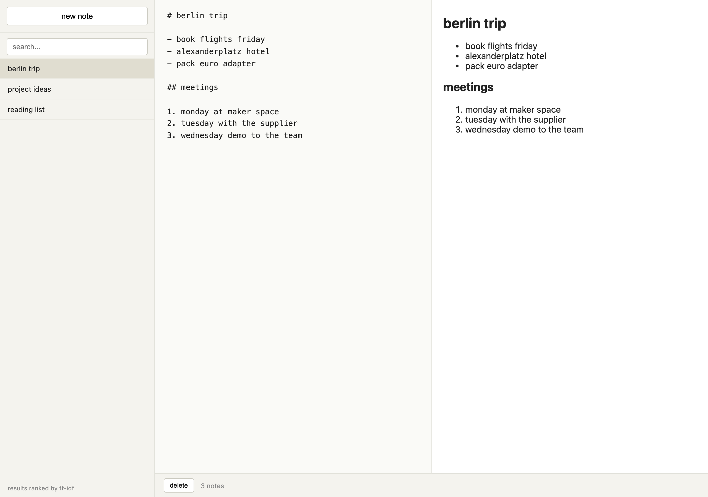

# notes



Plain markdown notes in the browser. Nothing fancy. The one thing I cared about was the search, so it ranks by relevance instead of just substring matching.

## Run it

No build step. Open the html file.

```
git clone https://github.com/secanakbulut/notes.git
cd notes
open index.html
```

Notes live in `localStorage` under the key `notes.v1`, so they stay between sessions on the same browser. Clear your storage and they are gone, fair warning.

## What it does

- new note, edit, delete
- live markdown preview while you type, via marked
- a list of all notes, the title is just the first heading or first line
- a search box that ranks by tf-idf and shows the score next to each result

## How the search works

Classic tf-idf. For every query word, we compute:

```
tf(term, note)  = count of term in note / total terms in note
idf(term)       = log( total_notes / number_of_notes_containing_term )
score(note, q)  = sum over q of  tf * idf
```

So a word that appears a lot in one note but rarely across the rest pushes that note up. A word that is in every note (or in the stopword list) carries no weight. Tiny smoothing on the idf so a term in every doc does not collapse to exactly zero.

The score shown next to each result is just the raw sum, higher is better. It is not normalized to 0..1 on purpose, the absolute value lets you eyeball whether a match is strong or scraping by.

## Files

- `index.html` layout and the marked CDN tag
- `style.css` two pane editor, sidebar, the small score pill
- `app.js` state, localStorage, render
- `search.js` tokenizer, index builder, scoring

## Stack

vanilla js, no framework, no bundler. marked.js loaded from a cdn for the preview.

## License

PolyForm Noncommercial 1.0.0. Free for personal and non-commercial use, see `LICENSE` for the rest.
